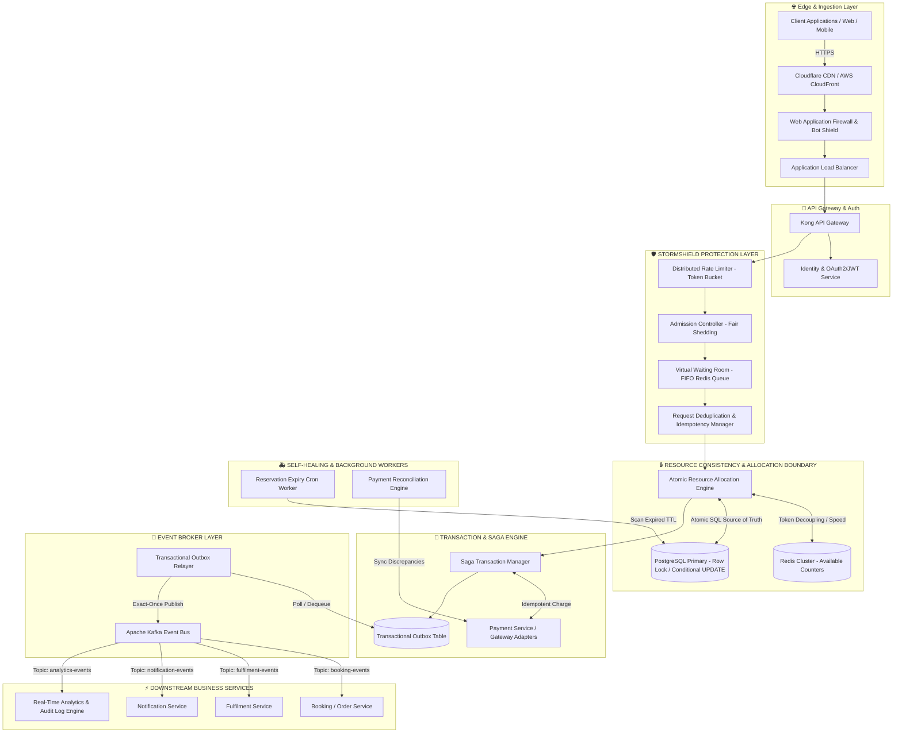
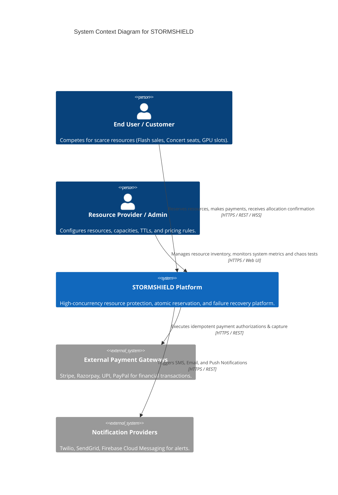
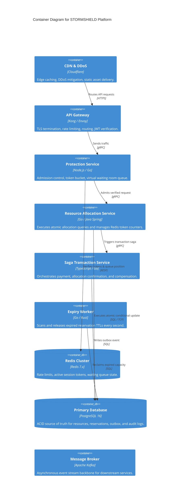

# 🏗️ 02. High-Level System Architecture (HLD) & C4 Diagrams

## 1. High-Level Architecture (HLD)

STORMSHIELD decouples public traffic ingestion and protection from the underlying resource consistency engine and asynchronous downstream processing.

---

## 2. C4 Architecture Diagrams

### 2.1 C4 Level 1: System Context Diagram

### 2.2 C4 Level 2: Container Diagram

---

## 3. STORMSHIELD Protection Layer Details

The core differentiator of STORMSHIELD is: **"Protect the scarce resource before protecting the rest of the system."**

Instead of allowing 500,000 requests to hit the database layer directly, traffic passes through 12 protection gates:

1. **Distributed Rate Limiter:** Token Bucket algorithm implemented in Redis Lua scripts to enforce client/IP rate limits.
2. **Admission Controller:** Evaluates current database queue depth and sheds excess traffic before entering database threads.
3. **Virtual Waiting Room:** Organizes admitted traffic into a deterministic FIFO Redis ZSET queue when demand exceeds processing rate.
4. **Request Deduplicator:** Rejects duplicate incoming payloads based on `SHA-256(payload + user_id)`.
5. **Idempotency Manager:** Ensures requests with the same `Idempotency-Key` header return cached responses without re-executing logic.
6. **Resource Contention Controller:** Shards hot-key resources across internal partition keys to minimize row lock contention.
7. **Reservation Manager:** Allocates temporary locks on resource units linked to customer IDs.
8. **Reservation Expiry Manager:** Background ticker that asynchronously frees abandoned reservations.
9. **Backpressure Controller:** Signals upstream API Gateway to return `HTTP 429 Too Many Requests` or `HTTP 503 Retry-After` when queue thresholds are breached.
10. **Priority/Fairness Manager:** Supports VIP tiers, emergency priority, or FIFO fairness without causing lower-tier starvation.
11. **Circuit Breaker:** Wraps external dependencies (Payment Gateways, SMS) to fail fast when error rates exceed $50\%$.
12. **Retry Controller:** Implements exponential backoff with random jitter to prevent retry thundering herds.

---

## 4. Service Boundaries & Responsibilities

| Service Name | Primary Responsibility | Data Store Owned | Communication Pattern |
|---|---|---|---|
| **Identity Service** | User authentication, OAuth2 token issuance, RBAC enforcement. | Auth DB (Users, Roles) | Synchronous REST / JWT |
| **STORMSHIELD Protection Service** | Rate limiting, admission control, token bucket, waiting room. | Redis Cluster (Tokens, Queues) | gRPC / High Speed |
| **Resource Allocation Service** | Atomic resource availability check, temporary locking, capacity updates. | PostgreSQL Primary (Resources, Capacities) | Synchronous gRPC / SQL |
| **Reservation Service** | Manages reservation lifecycles, TTL timestamps, and expiry releases. | PostgreSQL (Reservations Table) | Synchronous SQL + Async Cron |
| **Transaction Service (Saga)** | Orchestrates multi-step allocation, payment execution, and rollback compensations. | PostgreSQL (Saga State, Outbox) | Asynchronous Saga Events |
| **Payment Service** | Abstracts external payment gateways (Card, UPI, Wallet) with circuit breakers. | Payment DB (Attempts, Logs) | REST Gateway APIs |
| **Fulfilment Service** | Processes post-payment resource delivery (Ticket issuance, GPU provisioning). | Fulfilment DB | Async Kafka Consumer |
| **Notification Service** | Sends SMS, Email, and Push alerts asynchronously. | No state (Stateless) | Async Kafka Consumer |
| **Reconciliation Service** | Scans for orphan payments, zombie reservations, and outbox lags. | Read Replicas / Audit Logs | Scheduled Background Jobs |
