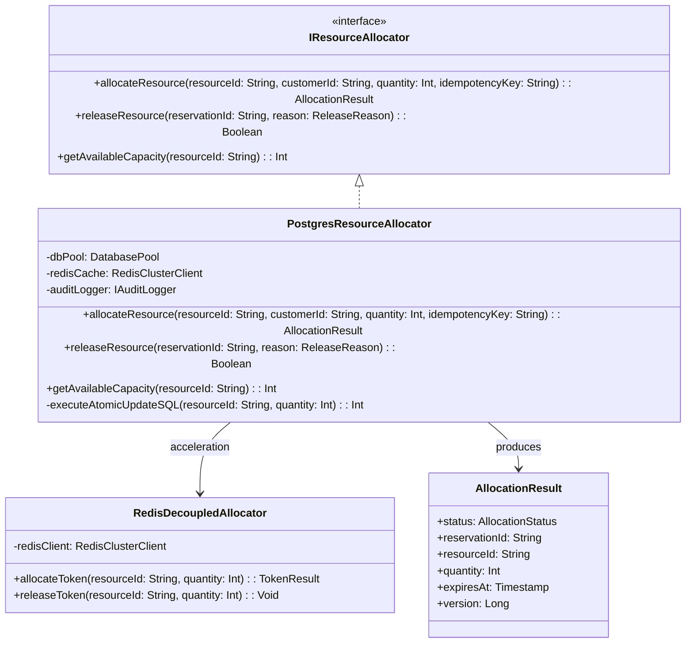
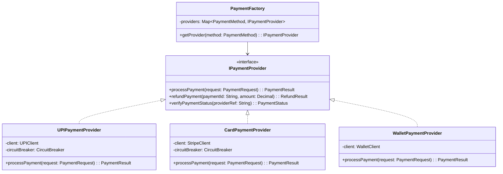

# 📐 03. Low-Level Design (LLD) & Class Diagrams

## 1. Core Module Interfaces & Class Diagrams

STORMSHIELD enforces strict separation of concerns using clean interface-driven object models.

### 1.1 Resource Allocation Module Class Diagram



### 1.2 Reservation & Expiry Manager Class Diagram

```mermaid
classDiagram
    class IReservationManager {
        <<interface>>
        +createReservation(request: ReservationRequest): Reservation
        +confirmReservation(reservationId: String): Reservation
        +cancelReservation(reservationId: String, reason: String): Reservation
        +expireStaleReservations(): Int
    }

    class ReservationManagerImpl {
        -reservationRepo: IReservationRepository
        -resourceRepo: IResourceRepository
        -eventPublisher: IEventPublisher
        +createReservation(request: ReservationRequest): Reservation
        +confirmReservation(reservationId: String): Reservation
        +cancelReservation(reservationId: String, reason: String): Reservation
        +expireStaleReservations(): Int
    }

    class Reservation {
        +reservationId: String
        +resourceId: String
        +customerId: String
        +quantity: Int
        +status: ReservationState
        +createdAt: Timestamp
        +expiresAt: Timestamp
        +idempotencyKey: String
        +isExpired(): Boolean
    }

    <<enumeration>> ReservationState
    ReservationState : AVAILABLE
    ReservationState : RESERVED
    ReservationState : TRANSACTION_PENDING
    ReservationState : CONFIRMED
    ReservationState : RELEASED
    ReservationState : EXPIRED

    IReservationManager <|.. ReservationManagerImpl
    ReservationManagerImpl --> Reservation
    Reservation --> ReservationState
```

### 1.3 Payment Gateway Abstraction Class Diagram



---

## 2. Core Code Interfaces (TypeScript Implementation)

### 2.1 Resource Allocator Interface

```typescript
export interface AllocationRequest {
  resourceId: string;
  customerId: string;
  quantity: number;
  idempotencyKey: string;
  ttlSeconds: number;
}

export interface AllocationResult {
  success: boolean;
  reservationId?: string;
  resourceId: string;
  allocatedQuantity: number;
  expiresAt?: Date;
  errorCode?: 'INSUFFICIENT_CAPACITY' | 'IDEMPOTENCY_DUPLICATE' | 'RESOURCE_LOCKED';
}

export interface IResourceAllocator {
  allocate(request: AllocationRequest): Promise<AllocationResult>;
  release(reservationId: string, reason: string): Promise<boolean>;
  getCapacity(resourceId: string): Promise<{ total: number; available: number; reserved: number }>;
}
```

### 2.2 Atomic SQL Allocation Implementation (Node.js / pg-pool)

```typescript
import { Pool } from 'pg';

export class PostgresAtomicAllocator implements IResourceAllocator {
  constructor(private pool: Pool) {}

  async allocate(req: AllocationRequest): Promise<AllocationResult> {
    const client = await this.pool.connect();
    try {
      await client.query('BEGIN;');

      // Check idempotency record first
      const existingIdem = await client.query(
        'SELECT response, status FROM idempotency_record WHERE idempotency_key = $1 FOR UPDATE;',
        [req.idempotencyKey]
      );

      if (existingIdem.rowCount && existingIdem.rowCount > 0) {
        await client.query('COMMIT;');
        return JSON.parse(existingIdem.rows[0].response);
      }

      // Execute Atomic Conditional Capacity Reduction
      const updateRes = await client.query(
        `UPDATE resource_capacity
         SET available_capacity = available_capacity - $1,
             reserved_capacity = reserved_capacity + $1,
             version = version + 1,
             updated_at = NOW()
         WHERE resource_id = $2
           AND available_capacity >= $1
         RETURNING version, available_capacity;`,
        [req.quantity, req.resourceId]
      );

      if (updateRes.rowCount === 0) {
        await client.query('ROLLBACK;');
        return {
          success: false,
          resourceId: req.resourceId,
          allocatedQuantity: 0,
          errorCode: 'INSUFFICIENT_CAPACITY'
        };
      }

      // Create Reservation Record
      const expiresAt = new Date(Date.now() + req.ttlSeconds * 1000);
      const resInsert = await client.query(
        `INSERT INTO reservation (resource_id, customer_id, quantity, status, expires_at, idempotency_key)
         VALUES ($1, $2, $3, 'RESERVED', $4, $5)
         RETURNING reservation_id;`,
        [req.resourceId, req.customerId, req.quantity, expiresAt, req.idempotencyKey]
      );

      const reservationId = resInsert.rows[0].reservation_id;

      const result: AllocationResult = {
        success: true,
        reservationId,
        resourceId: req.resourceId,
        allocatedQuantity: req.quantity,
        expiresAt
      };

      // Store Idempotency Entry
      await client.query(
        `INSERT INTO idempotency_record (idempotency_key, operation_type, resource_id, customer_id, response, status)
         VALUES ($1, 'RESERVATION', $2, $3, $4, 'COMPLETED');`,
        [req.idempotencyKey, req.resourceId, req.customerId, JSON.stringify(result)]
      );

      await client.query('COMMIT;');
      return result;
    } catch (err) {
      await client.query('ROLLBACK;');
      throw err;
    } finally {
      client.release();
    }
  }

  async release(reservationId: string, reason: string): Promise<boolean> {
    const client = await this.pool.connect();
    try {
      await client.query('BEGIN;');

      const resQuery = await client.query(
        `SELECT resource_id, quantity, status FROM reservation 
         WHERE reservation_id = $1 FOR UPDATE;`,
        [reservationId]
      );

      if (resQuery.rowCount === 0 || resQuery.rows[0].status !== 'RESERVED') {
        await client.query('ROLLBACK;');
        return false;
      }

      const { resource_id, quantity } = resQuery.rows[0];

      // Restore capacity atomically
      await client.query(
        `UPDATE resource_capacity
         SET available_capacity = available_capacity + $1,
             reserved_capacity = reserved_capacity - $1,
             version = version + 1
         WHERE resource_id = $2;`,
        [quantity, resource_id]
      );

      // Update reservation state
      await client.query(
        `UPDATE reservation SET status = 'RELEASED', updated_at = NOW() WHERE reservation_id = $1;`,
        [reservationId]
      );

      await client.query('COMMIT;');
      return true;
    } catch (err) {
      await client.query('ROLLBACK;');
      return false;
    } finally {
      client.release();
    }
  }

  async getCapacity(resourceId: string) {
    const res = await this.pool.query(
      `SELECT capacity as total, available_capacity as available, reserved_capacity as reserved 
       FROM resource_capacity WHERE resource_id = $1;`,
      [resourceId]
    );
    return res.rows[0] || { total: 0, available: 0, reserved: 0 };
  }
}
```

---

## 3. Reservation Expiry Worker Implementation

```typescript
export class ExpiryBackgroundWorker {
  private isRunning = false;

  constructor(
    private pool: Pool,
    private pollIntervalMs: number = 1000
  ) {}

  start() {
    this.isRunning = true;
    this.runLoop();
  }

  stop() {
    this.isRunning = false;
  }

  private async runLoop() {
    while (this.isRunning) {
      try {
        await this.sweepExpiredReservations();
      } catch (err) {
        console.error('[ExpiryWorker] Sweep error:', err);
      }
      await new Promise((r) => setTimeout(r, this.pollIntervalMs));
    }
  }

  async sweepExpiredReservations(): Promise<number> {
    const client = await this.pool.connect();
    try {
      await client.query('BEGIN;');

      // Select expired reservations in batch with lock
      const expiredRes = await client.query(
        `SELECT reservation_id, resource_id, quantity 
         FROM reservation 
         WHERE status = 'RESERVED' AND expires_at <= NOW() 
         LIMIT 100 FOR UPDATE SKIP LOCKED;`
      );

      if (expiredRes.rowCount === 0) {
        await client.query('COMMIT;');
        return 0;
      }

      for (const row of expiredRes.rows) {
        // Return capacity
        await client.query(
          `UPDATE resource_capacity 
           SET available_capacity = available_capacity + $1,
               reserved_capacity = reserved_capacity - $1,
               version = version + 1
           WHERE resource_id = $2;`,
          [row.quantity, row.resource_id]
        );

        // Mark as EXPIRED
        await client.query(
          `UPDATE reservation SET status = 'EXPIRED', updated_at = NOW() WHERE reservation_id = $1;`,
          [row.reservation_id]
        );
      }

      await client.query('COMMIT;');
      return expiredRes.rowCount || 0;
    } catch (err) {
      await client.query('ROLLBACK;');
      throw err;
    } finally {
      client.release();
    }
  }
}
```
