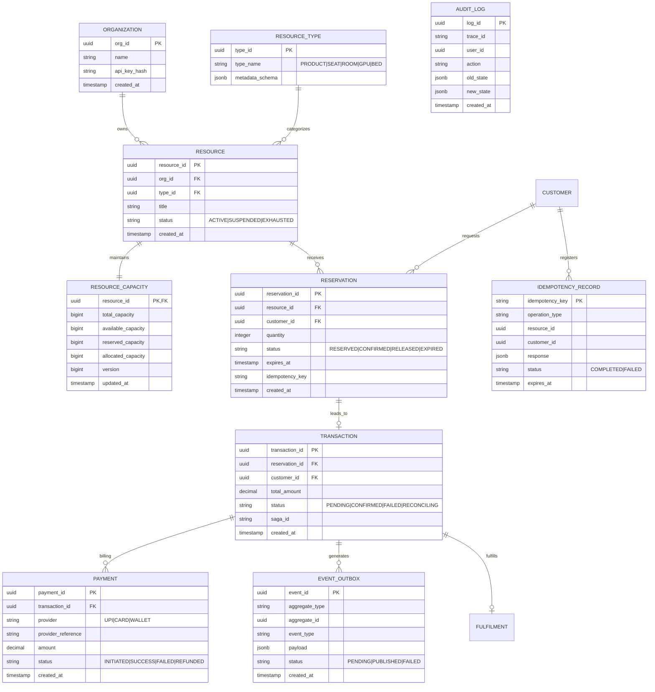

# 🗄️ 04. Database Design, Schemas & ER Diagram

## 1. Entity-Relationship (ER) Diagram



---

## 2. PostgreSQL DDL Schema Definitions

```sql
-- Enable UUID extension
CREATE EXTENSION IF NOT EXISTS "uuid-ossp";

-- 1. ORGANIZATION TABLE
CREATE TABLE organization (
    org_id UUID PRIMARY KEY DEFAULT uuid_generate_v4(),
    name VARCHAR(255) NOT NULL,
    api_key_hash VARCHAR(512) NOT NULL,
    created_at TIMESTAMPTZ NOT NULL DEFAULT NOW()
);

-- 2. RESOURCE TYPE TABLE
CREATE TABLE resource_type (
    type_id UUID PRIMARY KEY DEFAULT uuid_generate_v4(),
    type_name VARCHAR(64) UNIQUE NOT NULL, -- PRODUCT, SEAT, ROOM, GPU, BED, PARKING
    metadata_schema JSONB DEFAULT '{}'::jsonb
);

-- 3. RESOURCE TABLE
CREATE TABLE resource (
    resource_id UUID PRIMARY KEY DEFAULT uuid_generate_v4(),
    org_id UUID NOT NULL REFERENCES organization(org_id) ON DELETE CASCADE,
    type_id UUID NOT NULL REFERENCES resource_type(type_id),
    title VARCHAR(255) NOT NULL,
    status VARCHAR(32) NOT NULL DEFAULT 'ACTIVE',
    created_at TIMESTAMPTZ NOT NULL DEFAULT NOW(),
    updated_at TIMESTAMPTZ NOT NULL DEFAULT NOW()
);

-- 4. RESOURCE CAPACITY TABLE (Consistency Core Boundary)
CREATE TABLE resource_capacity (
    resource_id UUID PRIMARY KEY REFERENCES resource(resource_id) ON DELETE CASCADE,
    total_capacity BIGINT NOT NULL CHECK (total_capacity >= 0),
    available_capacity BIGINT NOT NULL CHECK (available_capacity >= 0),
    reserved_capacity BIGINT NOT NULL DEFAULT 0 CHECK (reserved_capacity >= 0),
    allocated_capacity BIGINT NOT NULL DEFAULT 0 CHECK (allocated_capacity >= 0),
    version BIGINT NOT NULL DEFAULT 1,
    updated_at TIMESTAMPTZ NOT NULL DEFAULT NOW(),
    -- Invariant Check Constraint
    CONSTRAINT check_total_integrity CHECK (available_capacity + reserved_capacity + allocated_capacity = total_capacity)
);

-- 5. IDEMPOTENCY RECORD TABLE
CREATE TABLE idempotency_record (
    idempotency_key VARCHAR(255) PRIMARY KEY,
    operation_type VARCHAR(64) NOT NULL,
    resource_id UUID,
    customer_id UUID,
    response JSONB NOT NULL,
    status VARCHAR(32) NOT NULL DEFAULT 'COMPLETED',
    expires_at TIMESTAMPTZ NOT NULL DEFAULT (NOW() + INTERVAL '24 hours'),
    created_at TIMESTAMPTZ NOT NULL DEFAULT NOW()
);

-- 6. RESERVATION TABLE
CREATE TABLE reservation (
    reservation_id UUID PRIMARY KEY DEFAULT uuid_generate_v4(),
    resource_id UUID NOT NULL REFERENCES resource(resource_id),
    customer_id UUID NOT NULL,
    quantity INT NOT NULL CHECK (quantity > 0),
    status VARCHAR(32) NOT NULL DEFAULT 'RESERVED', -- RESERVED, CONFIRMED, RELEASED, EXPIRED
    expires_at TIMESTAMPTZ NOT NULL,
    idempotency_key VARCHAR(255) UNIQUE NOT NULL,
    created_at TIMESTAMPTZ NOT NULL DEFAULT NOW(),
    updated_at TIMESTAMPTZ NOT NULL DEFAULT NOW()
);

-- 7. TRANSACTION TABLE
CREATE TABLE transaction (
    transaction_id UUID PRIMARY KEY DEFAULT uuid_generate_v4(),
    reservation_id UUID NOT NULL REFERENCES reservation(reservation_id),
    customer_id UUID NOT NULL,
    total_amount NUMERIC(12, 2) NOT NULL CHECK (total_amount >= 0),
    status VARCHAR(32) NOT NULL DEFAULT 'PENDING', -- PENDING, CONFIRMED, FAILED, RECONCILING
    saga_id VARCHAR(255) NOT NULL,
    created_at TIMESTAMPTZ NOT NULL DEFAULT NOW(),
    updated_at TIMESTAMPTZ NOT NULL DEFAULT NOW()
);

-- 8. PAYMENT TABLE
CREATE TABLE payment (
    payment_id UUID PRIMARY KEY DEFAULT uuid_generate_v4(),
    transaction_id UUID NOT NULL REFERENCES transaction(transaction_id),
    provider VARCHAR(64) NOT NULL, -- UPI, CARD, WALLET, BANK_TRANSFER
    provider_reference VARCHAR(255) UNIQUE,
    amount NUMERIC(12, 2) NOT NULL,
    status VARCHAR(32) NOT NULL DEFAULT 'INITIATED', -- INITIATED, SUCCESS, FAILED, REFUNDED
    created_at TIMESTAMPTZ NOT NULL DEFAULT NOW(),
    updated_at TIMESTAMPTZ NOT NULL DEFAULT NOW()
);

-- 9. EVENT OUTBOX TABLE
CREATE TABLE event_outbox (
    event_id UUID PRIMARY KEY DEFAULT uuid_generate_v4(),
    aggregate_type VARCHAR(64) NOT NULL,
    aggregate_id UUID NOT NULL,
    event_type VARCHAR(128) NOT NULL,
    payload JSONB NOT NULL,
    status VARCHAR(32) NOT NULL DEFAULT 'PENDING', -- PENDING, PUBLISHED, FAILED
    retry_count INT NOT NULL DEFAULT 0,
    created_at TIMESTAMPTZ NOT NULL DEFAULT NOW(),
    published_at TIMESTAMPTZ
);

-- 10. AUDIT LOG TABLE
CREATE TABLE audit_log (
    log_id UUID PRIMARY KEY DEFAULT uuid_generate_v4(),
    trace_id VARCHAR(255) NOT NULL,
    user_id UUID,
    action VARCHAR(128) NOT NULL,
    old_state JSONB,
    new_state JSONB,
    created_at TIMESTAMPTZ NOT NULL DEFAULT NOW()
);
```

---

## 3. High-Performance Indexes for Concurrency & Sweep

```sql
-- Indexes for Expiry Worker scanning
CREATE INDEX idx_reservation_expiry_sweep 
ON reservation (status, expires_at) 
WHERE status = 'RESERVED';

-- Index for Idempotency expiry cleanup
CREATE INDEX idx_idempotency_expiry 
ON idempotency_record (expires_at);

-- Index for Outbox Worker polling
CREATE INDEX idx_outbox_pending 
ON event_outbox (status, created_at) 
WHERE status = 'PENDING';

-- Index for Resource Capacity lookup
CREATE INDEX idx_resource_capacity_lookup 
ON resource_capacity (resource_id, available_capacity);

-- Index for Audit Trail Tracing
CREATE INDEX idx_audit_trace 
ON audit_log (trace_id);
```
