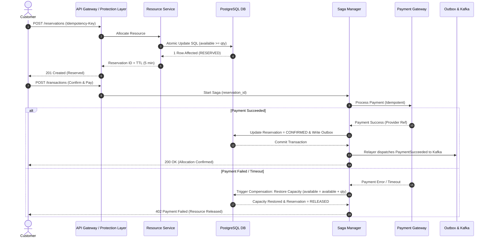

# ⚡ 08. Concurrency, Saga & Reliability Engineering

## 1. Concurrency Control Comparison & Benchmark Analysis

| Concurrency Mechanism | Throughput (req/sec) | Lock Contention | Failure Mode | Deadlock Risk | Complexity | Recommendation for STORMSHIELD |
|---|---|---|---|---|---|---|
| **Pessimistic Locking (`SELECT FOR UPDATE`)** | Low (500 - 2,000) | Extreme (Threads block waiting for row lock) | DB connection pool exhaustion | High | Low | ❌ Rejected for primary allocation path |
| **Optimistic Locking (`version = version + 1`)** | Medium (5,000 - 15,000) | High under contention (Aborts & Retries spike) | CPU thundering herd on retries | Zero | Low | ⚠️ Acceptable only for low-contention resources |
| **Atomic Conditional Update (`UPDATE ... WHERE available >= req`)** | **High (25,000 - 80,000)** | **Minimal (Single atomic SQL execution)** | **Zero rows affected (Instant fail)** | **Zero** | **Low** | **✅ PRIMARY CORE MECHANISM** |
| **Distributed Lock (Redis Redlock)** | Medium (10,000 - 20,000) | Medium (Key contention) | Lock timeout / split-brain | Medium | High | ❌ Avoided for DB core boundary |
| **Queue-Based Serialization (Single Thread Worker)** | High (50,000+) | Zero (In-memory FIFO) | Worker crash latency backlog | Zero | Medium | **✅ Integrated in Virtual Waiting Room** |

---

## 2. STORMSHIELD Core Allocation SQL Logic

STORMSHIELD uses **Atomic Conditional Updates** as its core inventory allocation mechanism:

```sql
UPDATE resource_capacity
SET available_capacity = available_capacity - $requested_quantity,
    reserved_capacity  = reserved_capacity  + $requested_quantity,
    version            = version + 1,
    updated_at         = NOW()
WHERE resource_id = $resource_id
  AND available_capacity >= $requested_quantity;
```

### Execution Guarantee Analysis:
- If `Rows Affected == 1`: **RESERVATION SUCCESSFUL**. Capacity was atomically deducted inside PostgreSQL engine's write lock without needing long-lived explicit transaction locks.
- If `Rows Affected == 0`: **RESERVATION FAILED**. Either resource ID does not exist or `available_capacity < requested_quantity`. The operation fails instantly in $< 2\text{ms}$ without modifying state.

---

## 3. Distributed Saga Orchestration & Compensation Workflow



---

## 4. Failure Handling Matrix

| Scenario | Detection Mechanism | Immediate System Response | Fallback / Recovery Strategy |
|---|---|---|---|
| **1. Database Unavailable** | DB pool connection timeout ($> 1000\text{ms}$). | Trip circuit breaker; protection layer returns `HTTP 503 Service Unavailable`. | Failover to passive PostgreSQL replica via Patroni; read operations routed to read-replicas. |
| **2. Redis Cache Down** | Redis client ping error. | Fallback directly to PostgreSQL atomic queries with rate limit throttling. | Redis cluster auto-failover to replica node; cache re-warm worker runs. |
| **3. Payment Provider Outage** | 5 consecutive HTTP 5xx responses or timeouts. | Circuit breaker trips `OPEN`; user notified "Payment Gateway Temporarily Unavailable". | Route traffic to secondary backup payment provider adapter seamlessly. |
| **4. Reservation Timeout** | Reservation TTL expires ($> 300\text{s}$) before payment confirmation. | Expiry Background Worker locks row `SKIP LOCKED`. | Restores `available_capacity` and sets status `EXPIRED`. |
| **5. Duplicate Request** | `Idempotency-Key` hit in database or Redis. | Returns exact original cached response payload. | No database capacity modification or payment call executed. |
| **6. Message Broker (Kafka) Crash** | Producer send error / ack timeout. | Transactions commit locally to PostgreSQL `event_outbox` table. | Outbox Relayer retries publishing once Kafka broker recovers (Zero event loss). |
| **7. Out-of-Order Events** | Consumer receives `PaymentSucceeded` before `ReservationCreated`. | Consumer compares event timestamps & version numbers. | Out-of-order events parked in buffer table until parent event processes. |
| **8. Network Partition** | Heartbeat loss between availability zones. | Split-brain prevention via Raft quorum consensus. | Unhealthy zone isolated; traffic routed to healthy AZ. |
