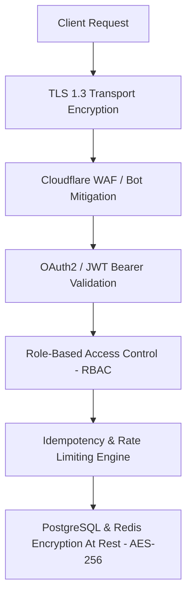

# 🔒 09. Security, Observability & Auditability

## 1. Security Architecture

STORMSHIELD implements defense-in-depth security principles across all architectural layers.



### Security Controls:
1. **Authentication & Authorization:** API Gateway validates short-lived RSA-256 signed JWT bearer tokens. Roles (`CUSTOMER`, `PROVIDER_ADMIN`, `SYSTEM_OPERATOR`) enforce endpoint RBAC permissions.
2. **Bot & Fraud Mitigation:** WAF inspects request fingerprints, IP reputation, and TLS handshake metrics. Rate limits shed automated bot scalping bursts.
3. **PCI-DSS Payment Security:** Raw credit card data is NEVER ingested, logged, or stored by STORMSHIELD. Payments are tokenized directly via client-side SDKs interfacing with PCI-DSS compliant providers (Stripe, Razorpay).
4. **Secrets Management:** Database passwords, JWT private keys, and payment API credentials are managed via HashiCorp Vault / AWS Secrets Manager and injected as environment variables at runtime.

---

## 2. Observability & OpenTelemetry Tracing

STORMSHIELD propagates a unified OpenTelemetry `X-Trace-ID` header across every HTTP request, gRPC call, database query, and Kafka message.

### Distributed Tracing Pipeline:
```
Client (Trace ID: tr-8812)
  ├──> API Gateway
  ├──> Admission Controller
  ├──> Resource Allocation Service (PostgreSQL query spans)
  ├──> Saga Transaction Service
  └──> Kafka Producer (Header: traceparent)
        └──> Downstream Consumer (Booking Service)
```

---

## 3. Key Prometheus Metrics & Alert Rules

### Critical Metrics Tracked:
- `stormshield_capacity_available{resource_id}`: Real-time available units gauge.
- `stormshield_oversubscription_total`: Counter for negative inventory occurrences (**MUST BE 0 AT ALL TIMES**).
- `stormshield_reservation_requests_total{status="SUCCESS|FAILURE"}`: Reservation attempt counters.
- `stormshield_payment_circuit_breaker_state`: State gauge ($0 = \text{CLOSED}$, $1 = \text{OPEN}$).
- `stormshield_p99_latency_seconds`: Histogram measuring tail latency.

### Prometheus Critical Alert Definitions:

```yaml
groups:
  - name: stormshield_critical_alerts
    rules:
      - alert: ResourceOversubscriptionDetected
        expr: stormshield_oversubscription_total > 0
        for: 0m
        labels:
          severity: CRITICAL
        annotations:
          summary: "CRITICAL INVARIANT BREACH: Resource oversubscription detected!"
          description: "Allocated capacity has exceeded available total capacity for resource {{ $labels.resource_id }}"

      - alert: HighPaymentFailureRate
        expr: rate(stormshield_payment_requests_total{status="FAILED"}[5m]) / rate(stormshield_payment_requests_total[5m]) > 0.15
        for: 2m
        labels:
          severity: WARNING
        annotations:
          summary: "Payment Failure Rate Exceeds 15%"
          description: "External payment provider error rate spike detected."
```

---

## 4. Immutable Audit Logging Schema

All sensitive state transitions generate immutable audit logs stored in `audit_log`:

```json
{
  "log_id": "audit-992211-bb",
  "trace_id": "tr-992384-8812",
  "user_id": "cust-554433",
  "action": "RESERVATION_CONFIRMED",
  "resource_id": "9f8b4c20-1a2b-4c3d-8e9f-0a1b2c3d4e5f",
  "old_state": {
    "status": "RESERVED",
    "reserved_capacity": 18
  },
  "new_state": {
    "status": "CONFIRMED",
    "reserved_capacity": 16,
    "allocated_capacity": 42
  },
  "timestamp": "2026-10-05T12:01:31Z"
}
```
