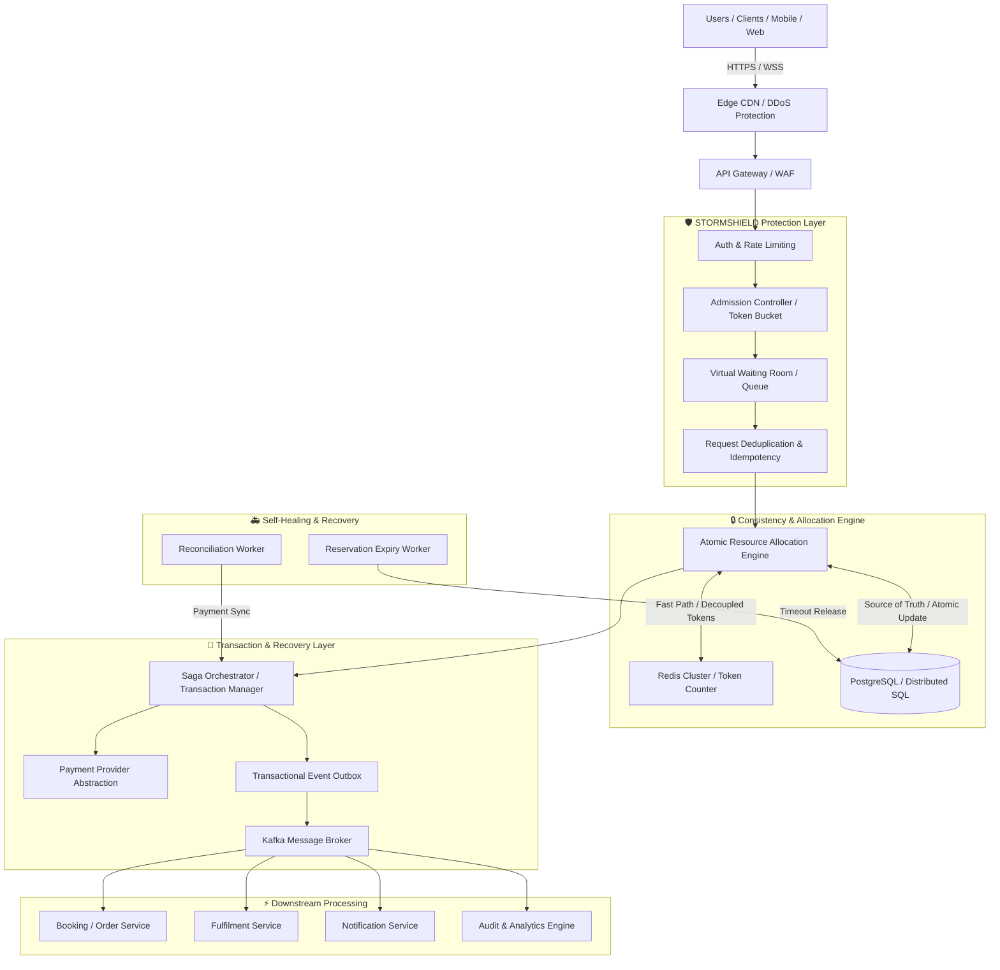

# 🛡️ STORMSHIELD: Generalized High-Concurrency Resource Protection & Transaction Control Platform

> **Tagline:** Protecting Critical Resources Under Extreme Concurrency  
> **Alternative Tagline:** Millions of Requests. Limited Resources. Zero Inconsistency.  
> **Hackathon Event:** SYSCRAFTERS 2026 – SALESTORM

---

## 📌 Executive Master Overview

**STORMSHIELD** is an industry-grade, generalized distributed systems platform engineered to solve one of computer science's most challenging problems:

> **"When thousands or millions of users simultaneously compete for a limited resource, how can the system guarantee correctness, prevent oversubscription/overselling, safely process transactions, recover from failures, and remain horizontally scalable?"**

While traditionally encountered in e-commerce flash sales, STORMSHIELD decouples resource reservation, consistency boundaries, payment abstraction, idempotency management, and failure recovery from any specific industry domain. It serves as a unified protection engine across 20+ high-concurrency verticals:

- **E-Commerce:** Limited-stock flash sale items
- **Ticketing & Entertainment:** Concert, sports stadium, and movie seat allocations
- **Travel & Logistics:** Airline seats, hotel rooms, train berths, rental vehicles
- **Urban Mobility & Infrastructure:** EV charging slots, parking space reservations
- **Healthcare:** Emergency ICU beds, doctor appointment slots
- **Cloud & AI Infrastructure:** High-demand GPU compute allocation (H100/A100 slots), serverless reservations

---

## ⚡ The Fundamental System Invariant

The core guarantee of STORMSHIELD is expressed mathematically and architecturally as:

$$\text{Successful Allocations} \le \text{Actual Available Resource Capacity}$$

$$\text{Available Capacity} \ge 0 \quad \forall t$$

$$\text{Allocated Capacity} + \text{Reserved Capacity} \le \text{Total Capacity}$$

> **Core Invariant Test:**  
> **Given:** 100 Resources Available | 10,000 Concurrent Requests  
> **Result:** Exactly 100 Successful Allocations, 9,900 Gracefully Shed/Queued Requests, **0 Oversubscription (Never 101)**.

---

## 🏗️ Master System Architecture Architecture (High-Level)



---

## 📁 Repository & Submission Structure

```
STORMSHIELD/
├── 01_Requirements/               # System Requirements, 20 Multi-Industry Use Cases & Scope
├── 02_HLD/                        # High-Level Architecture, C4 Diagrams, Protection Layer
├── 03_LLD/                        # Low-Level Design, Module Class Diagrams, Interfaces
├── 04_Database/                   # PostgreSQL Schema, Indexes, ER Diagram, Sharding Strategy
├── 05_API/                        # OpenAPI Specs, Idempotency Headers, Event Schemas
├── 06_SOLID/                      # Strict SOLID Mapping with TypeScript Code Examples
├── 07_Design_Patterns/            # Catalog of 12 GoF & Distributed System Patterns
├── 08_Scalability_Reliability/    # Concurrency Benchmarks, Saga Orchestration, Outbox, Expiry
├── 09_Security_Observability/     # OAuth2/JWT, PCI-DSS, Distributed Tracing, Alert Thresholds
├── 10_ADR/                        # Architecture Decision Records (ADR-001 to ADR-012)
├── 11_AI_Assisted_Validation/     # System Invariants, Chaos Engineering Matrix & Results
├── 12_Presentation/               # 5-Minute Technical Pitch Script & Jury Defense Q&A
└── README.md                      # Master Blueprint Summary
```

---

## 🛠️ Technology Stack & Trade-Off Decisions

| Layer | Chosen Technology | Architectural Justification | Alternatives Considered |
|---|---|---|---|
| **API Gateway & Routing** | Kong / Envoy | Sub-millisecond routing, WAF integration, JWT validation | Spring Cloud Gateway (Higher latency) |
| **Admission Control** | Token Bucket + Redis Lua | Non-blocking backpressure, protects consistency layer | Pure Queueing (Indefinite client delay) |
| **Consistency Engine** | PostgreSQL + Atomic SQL | Guaranteed ACID transactions, strict row-level conditional updates | Distributed Locks (Deadlocks, Redis failure edge cases) |
| **Caching Acceleration** | Redis Cluster | High-speed reservation token tracking and rate limiting | Memcached (Lacks atomic Lua scripts) |
| **Event Messaging** | Apache Kafka | Immutable log, exact-once delivery semantics via transactional producers | RabbitMQ (Lower throughput for multi-subscriber event streams) |
| **Transaction Pattern** | Saga Orchestration + Outbox | Solves distributed transactions across asynchronous services without 2PC locking | Two-Phase Commit (2PC) (Blocking, fragile under high concurrency) |

---

## 🚦 System Invariants Summary

1. **Capacity Boundary:** $\text{allocated} + \text{reserved} \le \text{total\_capacity}$.
2. **Non-Negativity:** $\text{available\_capacity} \ge 0$.
3. **Idempotency Execution:** $\text{Idempotency-Key} \to \text{Exactly One Business Execution}$.
4. **Payment Uniqueness:** $\text{One Payment Provider Reference} = \text{Exactly One Financial Transaction}$.
5. **Expiry Safety:** Expired reservations can NEVER transition to `CONFIRMED`.
6. **Outbox Durability:** Database commit and Event dispatch are strictly atomic via Outbox Table.

---

## 🚀 Quickstart: Running the STORMSHIELD Interactive Command Center

To run the live enterprise dashboard & chaos engineering workbench:

```bash
# Install dependencies
npm install

# Start the Vite development server
npm run dev
```

Open your browser at `http://localhost:5173` to experience real-time high-concurrency simulation, run chaos experiments, monitor zero-oversubscription invariants, and inspect interactive architecture diagrams.
